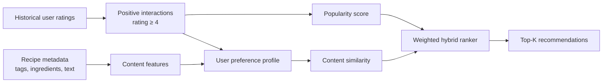

# CookSmart — Hybrid Recipe Recommendation System

CookSmart reframes the original recipe-rating analysis as a personalized recommendation system. Rather than predicting one global average rating for every recipe, it ranks unseen recipes that a specific user is likely to enjoy.

The project combines users' historical positive interactions with recipe metadata — title, description, tags, and ingredients — and compares several ranking approaches.

## Highlights

- Leakage-aware, time-based train/test split
- Popularity and content-based recommendation baselines
- LightFM experiment using interaction data and recipe metadata
- Validation-selected weighted hybrid recommender
- Ranking evaluation with Recall@10 and NDCG@10

## Result

The weighted hybrid was the strongest evaluated approach.

| Model | Recall@10 | NDCG@10 |
| --- | ---: | ---: |
| Popularity Baseline | 0.3032 | 0.1823 |
| Content-based Baseline | 0.2719 | 0.1655 |
| **Weighted Hybrid (content = 0.5)** | **0.3671** | **0.2311** |

LightFM is included as an additional hybrid-model experiment in the notebook. The weighted hybrid is selected on a validation split, then evaluated once on the held-out test set.

## Evaluation protocol

For every eligible user, the system uses earlier positive interactions as training history and holds out the most recent liked recipe for testing. Each model ranks that held-out recipe among 99 unseen candidates. Results are averaged across 10,404 users.

This makes the task: *can the system recover a recipe the user later liked without training on that event?*

## Repository contents

- [Notebook](CookSmart_Hybrid_Recipe_Recommendation.ipynb) — full reproducible pipeline, model implementations, and comparison charts
- [Technical report](docs/CookSmart_Recommendation_Report.md) — problem framing, data preparation, methodology, findings, and limitations

## Quick start

1. Download `RAW_recipes.csv` and `RAW_interactions.csv` from the original course dataset.
2. Update the two local file paths in the notebook's data-loading cell.
3. Install dependencies:

   ```bash
   pip install pandas numpy scipy scikit-learn matplotlib seaborn lightfm
   ```

4. Run the notebook from top to bottom.

## System overview



## Limitations and next steps

- Interaction histories are sparse, making popularity a strong reference model.
- Evaluation uses sampled candidates for efficient offline ranking; full-catalog retrieval is a useful next benchmark.
- Future work includes semantic recipe embeddings, richer user context, and a Streamlit recommendation interface.

## Author

Max Chiu
